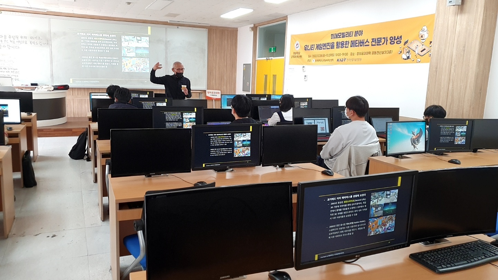

# Unity-HowToUse-BasicTutorials
유니티 학습

## Project Description

Learning Unity

### Platform
  Desktop (Windows OS)
  
### Requirement

[Unity 2021.3.11f1 (LTS)](https://unity3d.com/unity/qa/lts-releases?version=2021.3)

### Works

Package Manager (In Project) 에서 Post Processing 패키지를 업데이트 (버전업 2.0.3 에서 3.2.2 로)

## Images

* 실행화면

    </img>

* 맵

    </img>
    
* 강의

    </img>
    
## Contribution

See [CONTRIBUTING.md]

## License

[MIT License]

